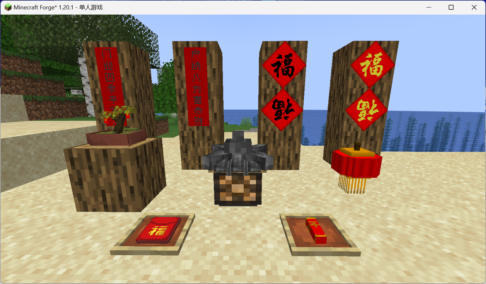
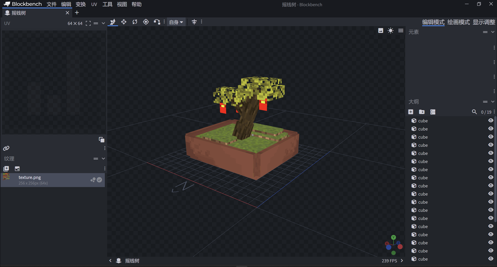

# MCLIVE的新年
## 1.简介
 - 这是一个使用Mcreator制作的Forge MOD  
 - 本模组为Minecraft添加了一些关于新年的物品和方块  
如图所示：  
   

## 2.引用
 - 本模组使用了 [中式工坊](https://https://github.com/574448121/ChineseWorkshop) 的石塔灯模型与贴图  
 - 在对联中使用了 [LanaPixel像素体](https://opengameart.org/content/lanapixel-localization-friendly-pixel-font) 的字体
 - 在福字种使用了华文行楷   
 - 其它模型与贴图均为本模组原创
 - 使用 [BlockBench](https://www.blockbench.net/) 制作模型，使用 [Aseprite](https://github.com/aseprite/aseprite) 绘制贴图 
   
 
## 3.其它说明
 - 本模组本来是专为 [MCLIVE社区服务器](https://msc.mclive.org) 所开发设计
 - 任何服务器均可无限制使用本模组，有想要新加的物品/方块欢迎提交 [Issues](https://github.com/Chun-QiuCC/mclive_newyear/issues)